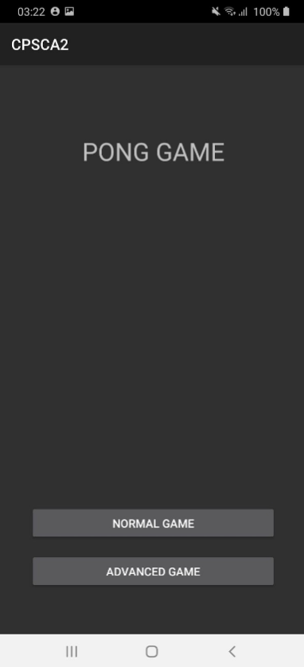
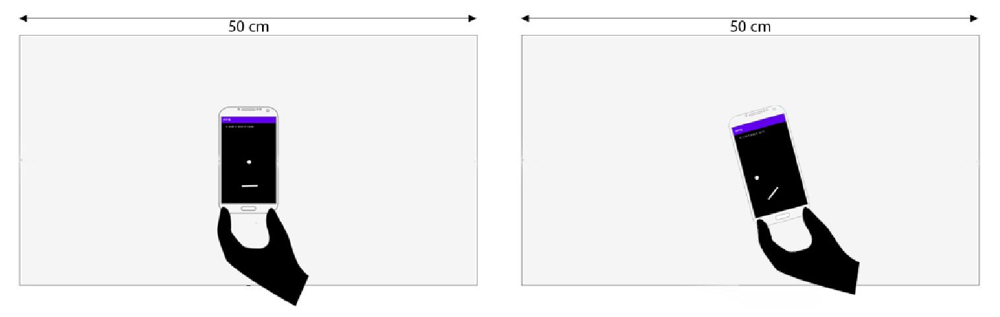
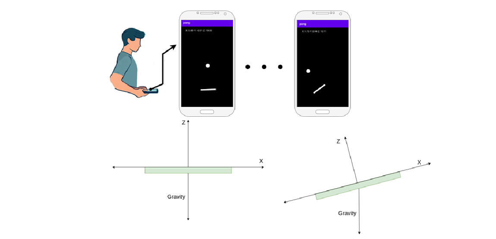

# Motion-Controlled-Pong-Game

This project aims to make a game similar to Pong, whose environment consists of a `ball` and a `paddle`. This game is designed as a single user and is controlled by using `accelerometer` and `gyroscope` sensors on a smartphone with the Android operating system. In this project, the `Canvas` library is used to draw two-dimensional components on the screen, and physical formulas are used to simulate the ball's motion and paddle.

This game has two modes:

    

## Normal
In this case, the device is placed on a flat surface like a table. The game environment on the table is 50 cm long; The device will be allowed to move 25 cm to the right and 25 cm to the left on the table. In whatever direction we move the device, the paddle will also move in the same direction. Also, if we rotate the device around its perpendicular axis, the paddle will rotate similarly.

    

## Advanced
In this case, the device is not placed on the table and is held parallel to the ground in the hands of the user. Gravitational acceleration is used to move the paddle on the X-axis of the screen. Also, when the ball hits the paddle, if we give a sudden upward acceleration in the Z direction of the circumference when the ball hits the paddle, the ball will travel a greater distance in the plane. This adverb simulates an actual ping pong paddle where the force applied to the ball upon impact will affect the speed of the ball. The rotation of the paddle in this mode will be like the normal mode with the help of the gyroscope sensor.

    

Contributors: [Parnian Fazel](https://github.com/parnianf), [Paria Khoshtab](https://github.com/Theparia/), [Ali Akhgari](https://github.com/AliAkhgari), [Mona Mojtahedi](https://github.com/Monamjh)

